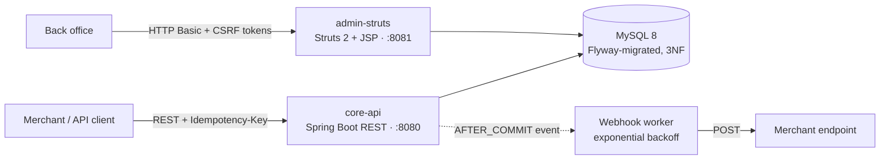
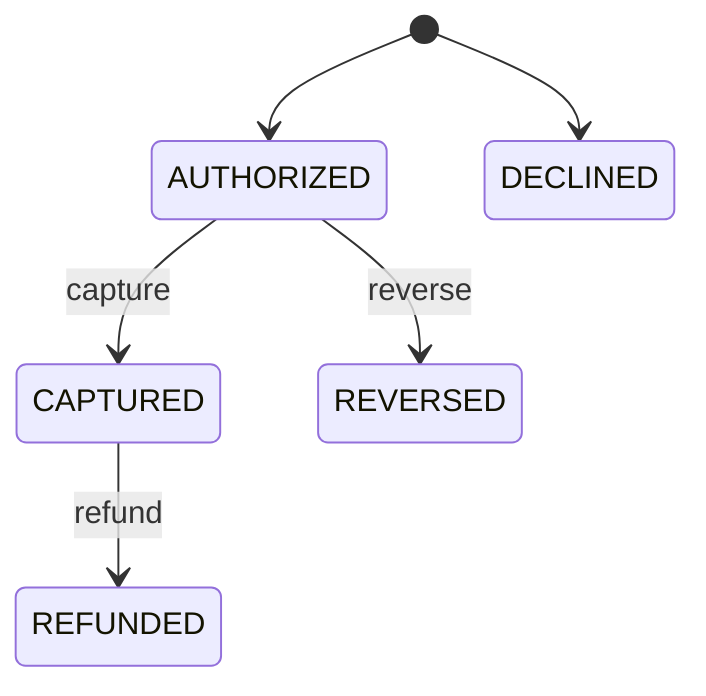

# CoreIssuer — a card-issuing payment engine

> Authorize → capture → reverse → refund with a **double-entry ledger that always balances**, idempotent APIs, a pluggable fraud engine, and a legacy Struts 2 admin module — all on Java 8 / Spring Boot.

[](https://github.com/umerrashid75/payment-engine/actions/workflows/ci.yml)
-orange)


Every dollar that moves through this system is recorded as a balanced debit/credit pair. A nightly reconciliation job re-proves the invariant `SUM(debits) = SUM(credits)` for every transaction and writes the report to disk. A Testcontainers suite fires concurrent authorizations at a real MySQL instance to prove the pessimistic locking prevents double-spending.

## Demo

*(60-second walkthrough gif coming soon)*

## Try it in 60 seconds

All you need is Docker.

```bash
git clone https://github.com/umerrashid75/payment-engine.git && cd payment-engine

# 1. Secrets — compose fails fast if these are missing
cp .env.example .env         # set COREISSUER_PEPPER, ADMIN_USER, ADMIN_PASSWORD

# 2. Build and start MySQL + both services (multi-stage build, no local JDK needed)
docker compose up --build -d

# 3. Provision a Premium card with $500
curl -s -X POST localhost:8080/api/v1/cards \
  -H 'Content-Type: application/json' \
  -d '{"tier":"PREMIUM","initialBalance":"500.00","currency":"USD"}'

# 4. Authorize a $42 charge — Idempotency-Key is mandatory
curl -s -X POST localhost:8080/api/v1/transactions/authorize \
  -H 'Idempotency-Key: 4a7f9b1e-0b2a-4c8a-91f4-1f3e2c4d5e6f' \
  -H 'Content-Type: application/json' \
  -d '{"cardId":"<id from step 3>","merchantId":"1","mcc":"5411","amount":"42.00","currency":"USD"}'

# 5. Replay step 4 → byte-identical response, no double charge.
#    Same key + different body → 409 conflict.

# 6. Capture the hold
curl -s -X POST localhost:8080/api/v1/transactions/<txn-id>/capture

# 7. Prove the books balance (admin endpoints require basic auth)
curl -s -u "$ADMIN_USER:$ADMIN_PASSWORD" localhost:8080/api/v1/admin/ledger/reconcile
```

| Surface | URL |
| --- | --- |
| Swagger UI | http://localhost:8080/swagger-ui.html |
| OpenAPI spec | http://localhost:8080/v3/api-docs |
| Health | http://localhost:8080/actuator/health |
| Admin UI (Struts 2) | http://localhost:8081/cards |

## Architecture



Two independently bootable services share one schema through a common JPA module — a deliberately realistic setup: a modern REST core operating alongside a legacy Struts back office.

- **`common`** — JPA entities, repositories (with `PESSIMISTIC_WRITE` locking), card factory, crypto utilities
- **`core-api`** — provisioning, authorization, capture/reverse/refund, idempotency, fraud, webhooks, reconciliation
- **`admin-struts`** — card freeze/close UI on Struts 2.5 (prototype-scoped actions, POST forms with session tokens)

## The ledger: follow one dollar

International merchants pay a 2.5% issuer fee. Here's a **$40.00 authorization from a Canadian merchant** (fee = $1.00) moving through the full lifecycle:

**1. Authorize** — hold `amount + fee` on the cardholder, credit the network settlement account:

| Posting | Debit | Credit | Amount |
| --- | --- | --- | --- |
| Hold | cardholder | network-settlement | $41.00 |

**2a. Capture** — split the hold: sale amount to the merchant, fee to fee revenue:

| Posting | Debit | Credit | Amount |
| --- | --- | --- | --- |
| Settlement | network-settlement | merchant | $40.00 |
| Fee | network-settlement | fee-revenue | $1.00 |

**2b. …or Reverse** — release the *entire* hold, fee included (a cardholder never pays a fee for a purchase that didn't happen):

| Posting | Debit | Credit | Amount |
| --- | --- | --- | --- |
| Release | network-settlement | cardholder | $41.00 |

**3. Refund** (after capture) — the sale returns to the cardholder; the fee stays earned:

| Posting | Debit | Credit | Amount |
| --- | --- | --- | --- |
| Refund | merchant | cardholder | $40.00 |

At every step, each transaction's debits equal its credits. The nightly job (and `GET /api/v1/admin/ledger/reconcile` on demand) re-verifies this for the entire ledger and buckets settlement volume per merchant per day.

Lifecycle transitions are enforced by an `EnumMap`-backed state machine — capturing twice or refunding an uncaptured transaction returns `409`, not a corrupted ledger:



## Correctness under concurrency

The headline integration test (`TransactionFlowIT`, real MySQL via Testcontainers): three threads simultaneously authorize $2.00 each against a card holding $5.00.

**Expected and asserted:** exactly 2 approvals, 1 `INSUFFICIENT_FUNDS` decline, final balance exactly $1.00.

Two mechanisms make this hold:

1. **Pessimistic row lock** — the balance check runs under `SELECT … FOR UPDATE` (`@Lock(PESSIMISTIC_WRITE)`), so parallel authorizations serialize on the account row and can never both spend the same dollar.
2. **Optimistic `@Version` column** — second line of defence against lost updates on longer transactions.

## Idempotent APIs

`POST /transactions/authorize` requires an `Idempotency-Key` header. The implementation is two-layered:

| Layer | Structure | Purpose |
| --- | --- | --- |
| In-memory | `ConcurrentHashMap` + atomic `putIfAbsent` | Lock-free replay short-circuit and in-flight marker (TTL-evicted: 24 h completed / 5 min in-flight) |
| Durable | `idempotency_record` table | Survives restarts; source of truth |

Semantics an integrator can rely on:

- Same key + same payload → the **stored response**, replayed byte-for-byte. No double charge.
- Same key + **different payload** → `409 conflict` (the request hash is compared on both cache and DB hits).
- Same key while the original is still in flight → `409`, and a crashed request's marker self-expires so retries are never wedged.

## Fraud engine — Chain of Responsibility

Checks are Spring-ordered `@Component`s; the chain short-circuits on the first block. Adding a rule means adding a class — no existing code changes.

| Order | Check | Declines with |
| --- | --- | --- |
| 1 | Amount ceiling (> $10,000) | `AMOUNT_CEILING_EXCEEDED` |
| 2 | Blocked MCCs (7995 gambling, 6012 quasi-cash) | `RESTRICTED_MCC` |
| 3 | Velocity: > 3 authorizations / 60 s / card, via a per-card `ArrayDeque<Instant>` sliding window | `VELOCITY_LIMIT_EXCEEDED` |

Declines are first-class outcomes: persisted as `DECLINED` transactions with a reason code, never exceptions.

## API reference

| Endpoint | Notes |
| --- | --- |
| `POST /api/v1/cards` | Provision card + cardholder account |
| `GET  /api/v1/cards/{id}` | Card + balance — **never** the PAN |
| `POST /api/v1/transactions/authorize` | `Idempotency-Key` required |
| `POST /api/v1/transactions/{id}/capture` | |
| `POST /api/v1/transactions/{id}/reverse` | Releases full hold, fee included |
| `POST /api/v1/transactions/{id}/refund` | |
| `GET  /api/v1/admin/ledger/reconcile` | HTTP Basic (`ADMIN_USER` / `ADMIN_PASSWORD`) |

```jsonc
// 200 — authorized
{ "transactionId": "8a2e…", "status": "AUTHORIZED", "amount": 42.00,
  "feeAmount": 0.00, "currency": "USD", "availableBalanceAfter": 458.00 }

// 200 — declined (a business outcome, not an error)
{ "transactionId": "9b1d…", "status": "DECLINED", "declineReason": "VELOCITY_LIMIT_EXCEEDED" }

// Errors use one envelope with meaningful status codes:
// 404 unknown resource · 409 state-machine/idempotency conflict · 400 validation
{ "error": "conflict", "detail": "Invalid transaction state transition from CAPTURED to CAPTURED" }
```

## Security posture

- **PAN/CVV never stored raw** — HMAC-SHA256 with a peppered key (`COREISSUER_PEPPER`, required at startup, no default). Card credentials are generated with `SecureRandom`, never `Random`.
- **Admin endpoints** behind HTTP Basic with env-supplied credentials; BCrypt-encoded in memory; app refuses to boot without them.
- **Webhook payloads are a dedicated DTO** — the JPA entity graph (PAN hashes, account balances) can never leak to an external endpoint.
- **Struts admin hardened** — state changes are POST forms with per-session tokens (CSRF/double-submit protection); actions are prototype-scoped; Struts 2.5.33 (patched for CVE-2023-50164).
- **Fail-fast configuration** — missing secrets stop the container at startup, not at first request.
- **Java 8 API discipline** — the whole build compiles with `--release 8`, so an API newer than the production JRE is a compile error, not a runtime crash.

## Design patterns — grep for them

Every pattern is labelled with a `Pattern:` Javadoc tag at its implementation site.

| Pattern | Where | Why it earns its place |
| --- | --- | --- |
| Factory | `common/…/factory/CardFactory.java` | Tier-specific card creation (BIN, PAN, hashed CVV) |
| Strategy | `core-api/…/strategy/` | Domestic vs. international fee routing by merchant country |
| Chain of Responsibility | `core-api/…/fraud/` | Ordered, short-circuiting fraud checks |
| State machine | `common/…/TransactionStateMachine.java` | `EnumMap` transition table guards the lifecycle |
| Observer | `core-api/…/event/` + `webhook/` | `AFTER_COMMIT` events decouple webhooks from money movement |
| Adapter | `core-api/…/webhook/HttpWebhookAdapter.java` | Transport swappable for Kafka/SNS without touching publishers |
| Builder | `core-api/…/dto/AuthorizeRequest.java` | Immutable request DTOs |

**Data-structure choices, with reasons:** `ConcurrentHashMap` (lock-free idempotency reads, atomic claim), `ArrayDeque<Instant>` (O(1) both-ends sliding window), `TreeMap<LocalDate, BigDecimal>` (date-sorted settlement buckets), `EnumMap` (canonical enum-keyed transition table). And **`BigDecimal(19,4)` everywhere money moves — never a float.**

## Reliability details worth reading

- **Webhooks**: an `@Async` listener persists deliveries only `AFTER_COMMIT` (no webhooks for rolled-back transactions); a scheduled worker retries with exponential backoff (1 m → 5 m → 30 m → 1 h → 2 h), gives up after 6 attempts, and records the last error. HTTP calls carry connect/read timeouts so one dead endpoint can't wedge the worker.
- **Caches are bounded**: idempotency entries and velocity windows are TTL-swept — no unbounded growth.
- **Flyway owns the schema** (`ddl-auto: validate`); versioned migrations, seed data included, verified on a pristine database by CI.

## Testing

```bash
./mvnw clean verify            # unit + Testcontainers integration tests (needs Docker)
./mvnw clean verify -DskipITs  # unit tests only
```

- **51 tests**: 47 unit (full `TransactionService` ledger assertions, fee paths, state machine, fraud rules, idempotency conflict semantics, reconciliation) + 4 integration (full lifecycle & the concurrent-authorization lock test against real MySQL 8).
- JaCoCo report at `core-api/target/site/jacoco/index.html`; uploaded as a CI artifact.
- CI (GitHub Actions) runs the entire suite — including Testcontainers — on every push and PR.

## Design decisions (the "why" behind the code)

<details>
<summary><b>Why a double-entry ledger instead of just updating balances?</b></summary>

Balances answer *what*; a ledger answers *why*. Every movement is an immutable, auditable pair, so any balance can be re-derived and any discrepancy is detectable mechanically. The reconciliation job is only possible because the source of truth is the journal, not the running totals.
</details>

<details>
<summary><b>Why pessimistic rather than optimistic locking on the balance check?</b></summary>

An authorization is short and contention is per-account. `SELECT … FOR UPDATE` gives a hard serialization point with trivial reasoning: two threads cannot both read $5 and both spend $4. Optimistic retry loops are better when conflicts are rare; here a conflict is the exact case that must be correct. `@Version` remains as a second line of defence. At 100× scale the row lock becomes the bottleneck — the migration path is per-card partitioning or event-sourced balances.
</details>

<details>
<summary><b>Why REQUIRES_NEW for idempotency record persistence?</b></summary>

The stored response must survive independently of the caller's transaction, so a replay can be answered even if surrounding work rolled back after the save.
</details>

<details>
<summary><b>Why decline on currency mismatch instead of converting?</b></summary>

There is no FX engine, and silently charging 100 EUR against a USD balance at 1:1 is a wrong answer that looks right. `CURRENCY_MISMATCH` is an honest decline until real FX rates exist.
</details>

<details>
<summary><b>Why is the fee released on reverse but kept on refund?</b></summary>

A reversal means the purchase never completed — the cardholder must be made whole, fee included. A refund is a completed purchase returned — the network's processing cost was genuinely incurred, so fee revenue keeps it. That distinction is why the fee is persisted on the transaction row.
</details>

## Known limitations (deliberate scope cuts)

- Merchant-facing endpoints are unauthenticated — production deployments front them with gateway auth (API keys / mTLS). Admin endpoints require basic auth.
- Merchant → settlement-account mapping is a naming convention (`acc-merchant-<merchantId>`), pending a real mapping table.
- The idempotency in-flight marker is single-node; multi-node needs a shared store or DB-level `INSERT … ON DUPLICATE KEY`.
- Spring Boot 2.7 is the last Java-8-compatible line and past OSS EOL — kept intentionally to honor the Java 8 requirement.

## Roadmap

- BNPL extension — split a captured transaction into installments (new state machine)
- Informix Maven profile — swap the Hibernate dialect to demonstrate portability
- Kafka backbone — replace the HTTP webhook adapter (the Adapter seam already exists)

## License

MIT
